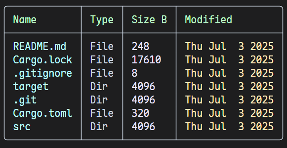

# Intro
A better ls by rust
- [x] Colorful display
- [x] Modern style

## How to use
- basically use `cargo run -- <PATH>` (if <PATH> not given, the default path is the root of current working directory)

- `cargo run -- -h` for help

- eg.
`cargo run`
`cargo run -- src`
`cargo run -- -j`
`cargo run -- --json`
`cargo run -- -V`